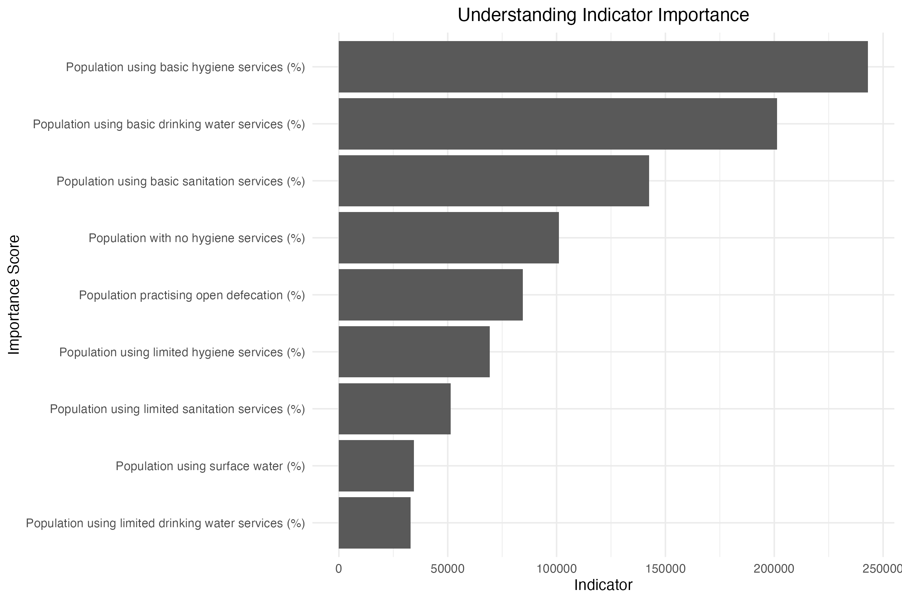

# ff-water-quality

## Project Navigation
* data/
  * country_indicators_and_fmr.csv - Our scrubbed and transformed data. This is the output .csv from code block 1 of water_health_correlation_pipeline.
  * fetal_mortality.csv - Under-5 mortality data. Taken from 'https://www.who.int/data/sets/health-inequality-monitor-dataset#igme-u5mr'
  * water_health_indicators - WASH indicator data. Taken from 'https://www.who.int/data/sets/health-inequality-monitor-dataset#wash'
* figures/
  * vip_plot.png
* results/
  * pearson_correlation_results.txt - Pearson correlation results between indicators and under-5 mortalityu. This is the output .txt from code block 2 of water_health_correlation_pipeline.qmd
* water_health_correlation_pipeline.qmd
  * This is our core pipeline that contains our data scrubber and data manipulation. It uses the Quatro medium. The medium is capable of interpretting both R and Python allowing each team member to play to their unique strengths.
***

# WASH Access and Child Mortality

## Research Question / Focus
What factors of water supply, sanitation, and hygiene are the biggest contributors to a country's infant mortality rate?

## Outcome Threshold
Infant mortality classification using World Bank reference (https://data.worldbank.org/indicator/SP.DYN.IMRT.IN):
- High > 39.2 deaths per 1,000 live births
- Low ≤ 39.2

This threshold was derived as the average infant mortality rate across 2000–2019 (inclusive).

## Data Sources
- WASH Indicators (WHO Health Inequality Monitor - JMP): https://www.who.int/data/sets/health-inequality-monitor-dataset#wash
- Under-5 Mortality (WHO Health Inequality Monitor - IGME): https://www.who.int/data/sets/health-inequality-monitor-dataset#igme-u5mr

## Indicators (independent variables)
- Population using basic drinking water services (%)
- Population using basic sanitation services (%)
- Population using basic hygiene services (%)

## Outcome (dependent variables)
- Infant mortality rate (under-5 mortality or infant mortality as reported in IGME)
- Optional proxy: diarrheal disease indicators if available and consistently linked by country-year

## Data Gathering / Data Cleaning
- Remove rows with missing values in variables used for a given analysis.
- One-hot encode categorical disaggregation:
  1. Life Expectancy (60+ = high(1), <60 = low(0))
  2. Indicators

## Data Completeness Consideration
Countries with insufficient data across the key WASH and mortality variables were identified.  
To maintain consistency and analytical reliability, countries with substantial missing values were excluded for correlation-based analyses, while broader visualizations could include all countries where data were available.

## Data Manipulation
- Join WASH indicators and infant mortality by country and year. (e.g., basic sanitation, open defecation)
- Create derived field(s) when needed:
  - High/low infant mortality label

## Aggregation
- Time-series (trend over 2000–2019, inclusive of both years)

## Analysis Plan
- Descriptive statistics for indicators and infant mortality
- Correlation analysis:
  - Compute Pearson correlations between each WASH indicator (% water, % sanitation, % hygiene) and infant mortality.
  - Report correlation coefficients.
- Fit a random forests classification model with fetal mortality as the outcome and WASH variables as predictors.
- Use feature importance scores to rank variables by their contribution. 

# Data Analysis:
We cleaned, processed, and analyzed WASH datasets using R and Python within Posit Cloud (Jupyter & RStudio) and google colab. The analysis work included data wrangling, statistical summaries, and exploratory techniques to identify patterns, relationships, and trends in the data. We also implemented a Random Forest model in R to support predictive analysis and evaluate feature importance.
# Data Visualization:
We created various visual outputs to communicate findings effectively. This included  scatter plots and other visual summaries built using Matplotlib in Python and ggplot2 in R. These charts helped highlight key patterns and illustrated important insights from the WASH datasets

Here is the plot for indicator importance:

# Tools & Libraries Used

Python: Matplotlib, Pandas, NumPy

R: ggplot2, tidyverse, caret, randomForest

Environment: Posit Cloud (RStudio & Jupyter)

# Team Members:
1.Chi Chi Okezie
2.Courtney-Grace Neizer
3.Darren Lee
4.Shivani Pawar
 
